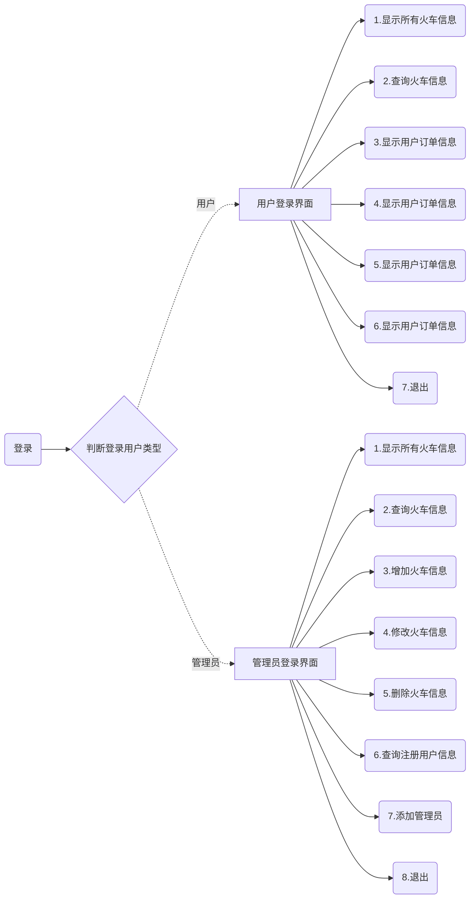

# 编译环境

Visual Studio 2019 Community

# 题目要求

1. 目标：实现火车票订票系统的基本功能：查询火车信息、增加火车信息（之前要判断该信息是否已经存在，不能增加相同的信息）、打印火车票信息、订票功能（根据用户输入的到达城市，并判断是否有余票，满足这些条件才能订票，订票成功后系统中的总票数要发生相应的变化），修改火车信息，保存火车信息到文件、保存订票人订票信息到硬盘，删除订票信息等功能。

   各个小组的同学在这个基本功能的基础上设计与丰富功能相关知识：

   1. 文件

   2. 结构体
   3. 指针
   4. 链表
   5. 字符串相关函数，比如strcpy(),strcmp()
   6. Sleep()函数,注意首字母大写
   7. 测试小组成果，在主函数中调用子函数，运行看结果

    

   

# 程序系统结构

